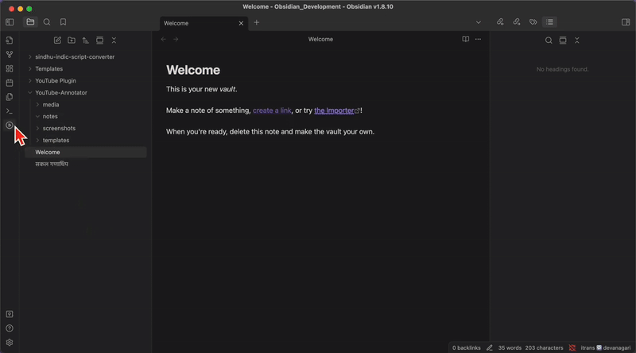
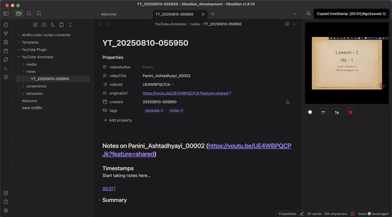
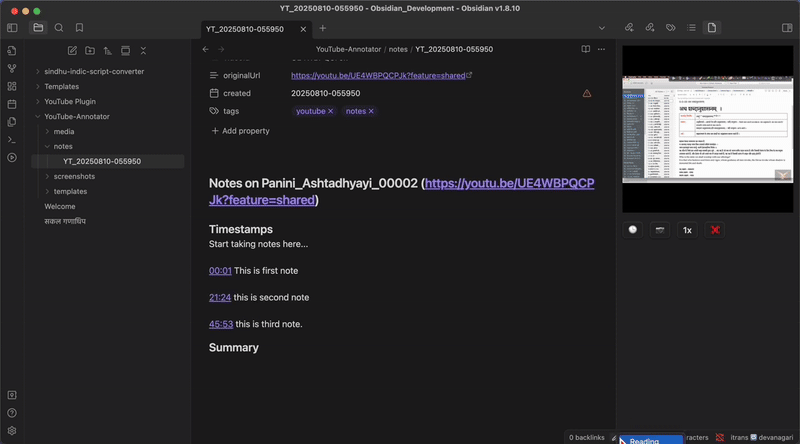

# YouTube Annotator
##Revolutionize How You Take Notes on YouTube

Annotate YouTube videos directly in Obsidian! This plugin lets you load a YouTube video in a side view, resize it to your liking, capture timestamps & screenshots, and sync notes with video playback — all within your vault.

## Features

- **Embedded YouTube player** side-by-side with your notes
-  **Capture timestamp** as `[mm:ss](ytseek://seconds)` with a button or hotkey
-  **Jump to timestamp** by clicking the link (works inside Obsidian!)
-  **Auto-generate notes** from a template with metadata:
  - `videoTitle`, `videoId`, `originalUrl`, `created`, etc.
-  **Auto-reload** video from YAML Frontmatter when reopening notes
-  **Hotkey support** for capturing timestamp (customizable)
- **Auto-Pause** when start taking notes and **Auto-Resume** after set delay
-  *Screenshot* capture & embed within Obsidian

---
#Features at a Glance
## Getting Started

1. Open the command palette and run:  
   **`Open YouTube Annotator`**
2. Click on the play icon on the ribbon,  Paste a YouTube link in the prompt.
3. The plugin will:
	- Save pasted Url, Extract the video ID, and put it in the YAML frontmatter. 
	- Load it in a new right-side pane which you can drag to get links and items
	- Create a new note using your chosen template
4. Start annotating and learning !!


| Feature | Demo |
|---------|------|
| Settings |  |
| Create Default folder |  |
| Paste YouTube URL |  |
| Add TimeStamp & Annotate |  |
| Jump to Saved location |  |

---

## Usage

- ** Timestamp button**: Adds a `[mm:ss](ytseek://seconds)` link to clipboard
- **Clicking timestamp**: Seeks the video in the side view (Obsidian-native!)
- **Note-to-Player sync**: Timestamps like `ytseek://89` jump to 1:29
- **Hotkey**: Bind your fav keyboard shortcut to "Capture YouTube Timestamp" in Settings → Hotkeys

---

### Installation
- From the Community Plugins Store
- In Obsidian, go to Settings -> Community plugins.
- Make sure "Restricted mode" is off.
 - Click Browse and search for "youtube-annotator".
- Click Install, once it's finished, click Enable.
- Full featured video coming soon

---
##  Settings Page

- `Template File`: Markdown file used to generate new notes
- `Notes Folder`: Where to create new YouTube notes
- `Filename Prefix`: Optional prefix like `YT_` or `YT-`
- `Timestamp Format`: Customize your preferred `MM/DD/YYYY`, ISO, etc.

---

## Template Variables

Your `template.md` file can include these placeholders:

```markdown
---
videoTitle: "{{videoTitle}}"
videoAuthor: "{{videoAuthor}}"
videoId: "{{videoId}}"
originalUrl: "{{originalUrl}}"
created: {{date}}
tags: [youtube, notes]
---
# ⚠️ Other Info
- YouTube-only support (for now) Currently optimized for YouTube video links. Support for other platforms (e.g., Vimeo, Loom) is planned in future updates.

- Windows screen capture includes extra padding On Windows, captured screenshots may include a slightly larger area than the selected region. This is due to platform-level rendering quirks. We're exploring tighter bounding fixes.